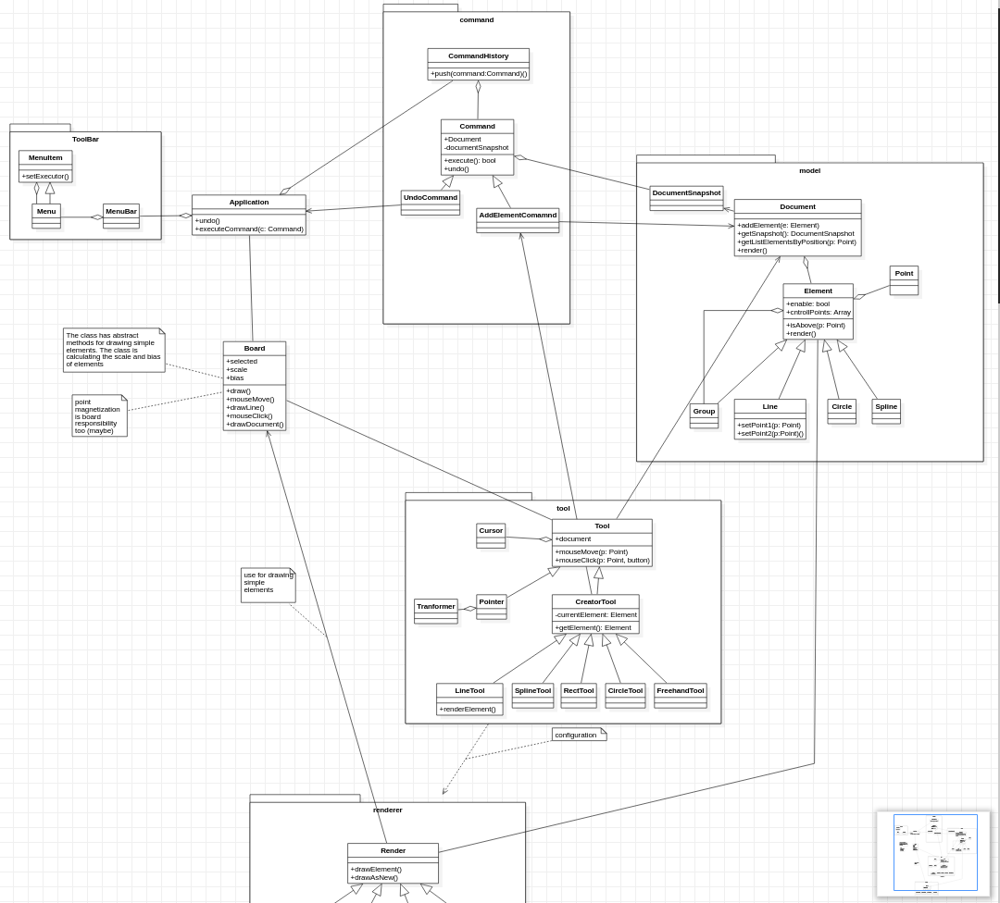

###About
The frontend part of eMachineShop CAD project.

###Compile
For compiling 3DView.js need using <code>npm start</code> or <code>npm compile</code>  for compiling, it can be use on deployment on a production server.

Before run the command execute <code>npm install</code> for installing all dependency.

##### App architecture

Class diagram

